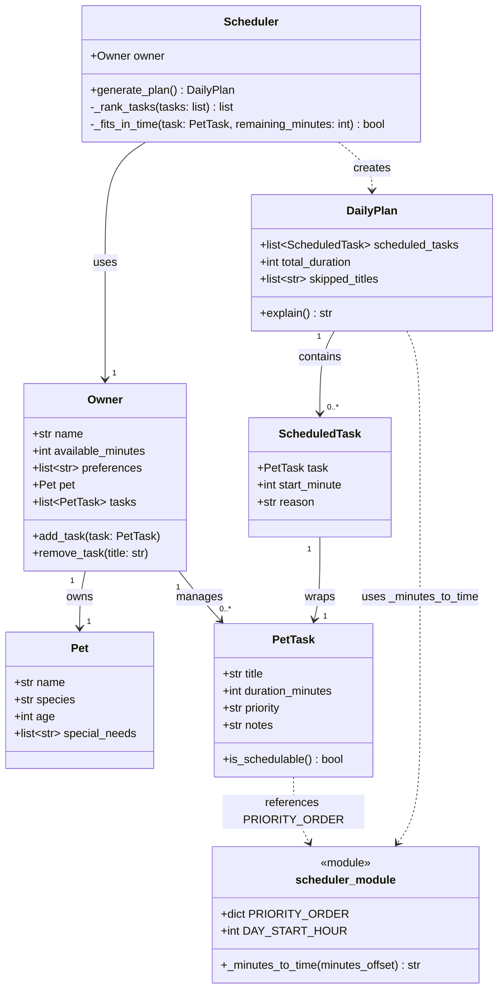

# PawPal+ UML Class Diagram

## Changes from original draft

- `scheduler_module` added — captures the module-level `PRIORITY_ORDER` dict, `DAY_START_HOUR` constant, and `_minutes_to_time()` helper that live outside any class
- `DailyPlan.total_duration` is computed in `__init__` from `scheduled_tasks`, not set externally
- `PetTask` and `DailyPlan` both carry a dashed dependency to `scheduler_module` reflecting their runtime use of its contents
